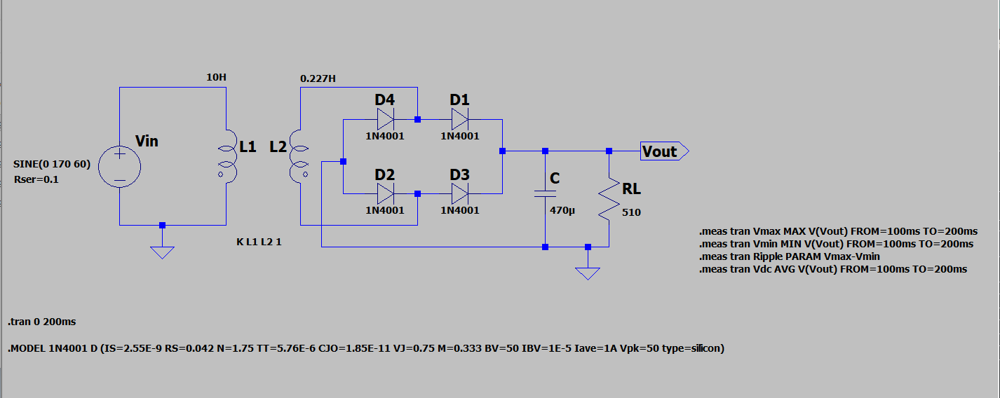
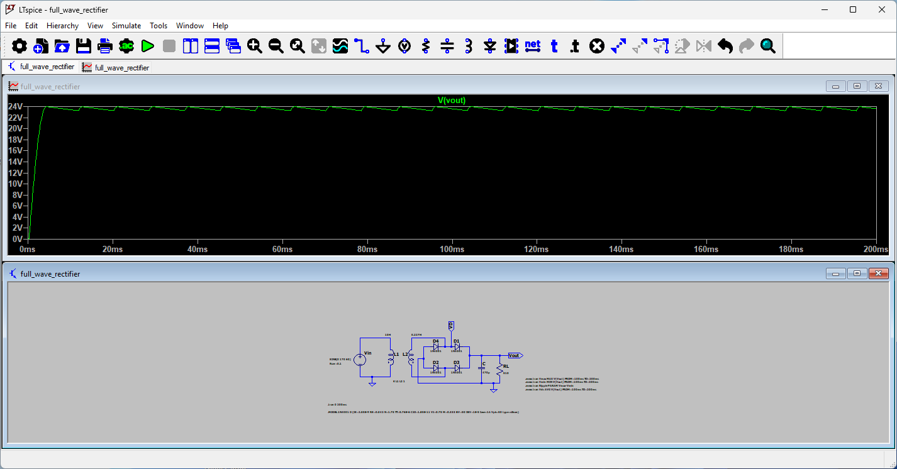
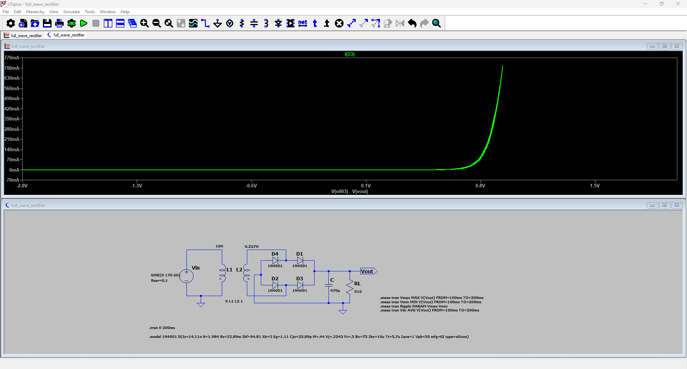
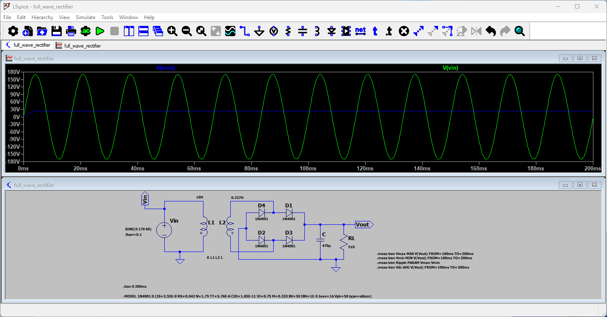

# Full-Wave Rectifier 

## Introduction
This project presents the **design and simulation of a full-wave bridge rectifier** using **LTSpice XVII**.  
The circuit converts a **120 Vrms AC input** into a **DC output around 20 V** through a **6:1 step-down transformer**, **diode bridge**, and **RC filter**.  

The goal is to analyze the rectification process, measure the **ripple voltage**, and compare theoretical results with simulated values.

---

## Objectives
- Design a full-wave rectifier with a step-down transformer (6:1 ratio).  
- Simulate the circuit in LTSpice and obtain **VL**, **VD**, and **ripple voltage (ΔVr)**.  
- Compare simulated data with theoretical calculations.  
- Observe how the **filter capacitor** smooths the output voltage.

---

## Circuit Specifications

| Parameter | Symbol | Value / Description |
|------------|---------|--------------------|
| Input Voltage | \( Vin \) | 120 Vrms, 60 Hz |
| Transformer | k | Step-down, 6:1 ratio |
| Diodes | D1–D4 | 1N4001 |
| Filter Capacitor | C | 470 µF |
| Load Resistor | RL | 510 Ω |
| Simulation Time | `.tran` | 0 → 200 ms |
| Coupling Coefficient |  | 1 (ideal) |

### LTSpice Schematic

---

## Simulation Results

| Parameter | Theoretical | Simulated | Units |
|------------|-------------|------------|-------|
| DC Output Voltage \( VDC \) | 26.9 | 23.62 | V |
| Ripple Voltage \( ΔVr \) | 0.922 | 0.72 | Vpp |
| Diode Forward Drop \( VD \) | 0.7 | 0.84 | V |

### Output Voltage Waveform (VL)

### Diode Voltage Waveform (VD)

### Full Wave Rectifier Behavior

The following simulation snapshot shows the waveform of the output voltage after rectification and filtering. It illustrates the voltage stabilization and ripple reduction achieved by the RC filter.

---

## Analysis

| Measurement | Symbol | Value | Units |
|--------------|---------|--------|--------|
| Maximum Output Voltage | \( Vmax \) | 23.96 | V |
| Minimum Output Voltage | \( Vmin \) | 23.25 | V |
| Ripple Voltage | \( ΔVr = Vmax - Vmin \) |0.72 | Vpp |
| Average DC Voltage | \( VDC \) | 23.62 | V |

**Data Source:** [LTSpice log file](analysis/full_wave_rectifier.log)

The theoretical values were computed in [calculations.pdf](analysis/calculations.pdf)

---

## Discussion of Results

The simulation results demonstrate the expected behavior of a full-wave rectifier with RC filtering, even though the DC output did not reach the originally intended 20 V. The output voltage stabilized at approximately **23.62 V**, which aligns well with the peak voltage after stepping down and rectifying the 120 Vrms input signal.

Key observations include:

- The input AC waveform (~170 V peak) was successfully transformed and rectified, producing a pulsating DC signal.
- The 6:1 transformer reduced the voltage to ~28.3 V peak at the secondary side, before diode drops.
- The voltage ripple remained low (**~0.72 Vpp**), indicating that the **470 µF capacitor** provided effective smoothing.
- The slight overshoot above 20 V is due to:
  - Ideal transformer coupling (**k = 1**) and no internal losses.
  - Ideal diode behavior in LTSpice (model drop ≈ 0.7–0.84 V).
  - Capacitor holding the voltage near the peak between cycles.

 - Although the simulation voltage was higher than the design target, this behavior is consistent with ideal modeling conditions. In real-world scenarios, the output would be closer to 20 V due to **core losses, non-ideal coupling (k < 1)**, and **equivalent series resistance (ESR)** in components.
   
---

## Conclusions

This project demonstrated the successful implementation of a full-wave rectifier circuit with filtering, producing a steady DC output from an AC source. The simulation highlighted key aspects of power electronics, such as waveform shaping, ripple reduction, and voltage stabilization.

Through the use of LTSpice, the behavior of each component was visualized and evaluated, reinforcing core concepts in analog circuit design. The experience also emphasized the role of simulation in predicting circuit performance and identifying potential limitations before physical prototyping.

Overall, the project served as a valuable exercise in combining theoretical knowledge with simulation tools to analyze real-world power conversion systems.

---

## References
- Sedra & Smith — *Microelectronic Circuits*, 7th Edition  
- 1N4001 Diode Datasheet (ON Semiconductor)  
